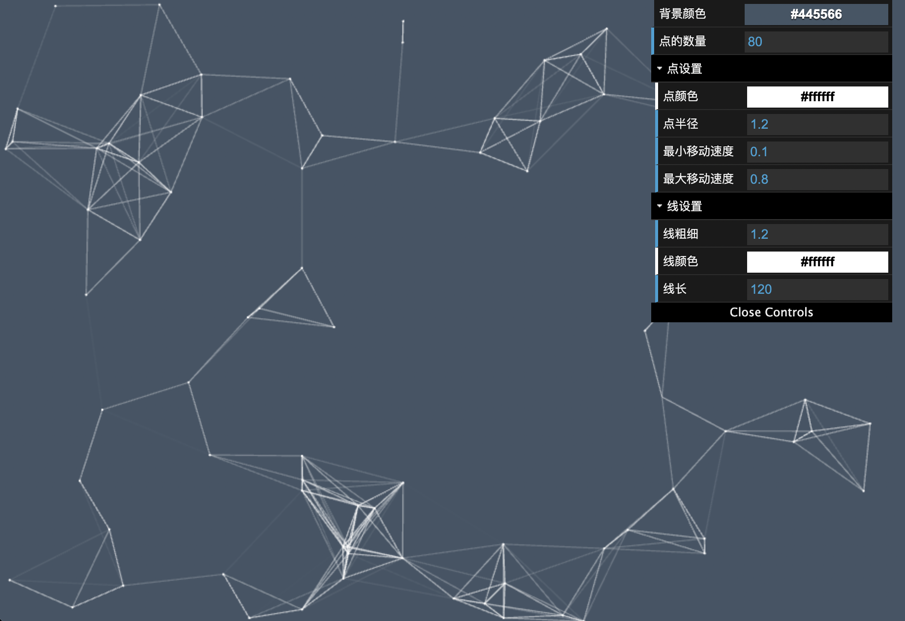

# canvas-starry-particle
canvas封装的可配置的星空粒子特效

### 启动方式
 - npm install
 - npm start
 - npm run build:prod

### 项目简介
基于canvas封装的星空粒子，[预览](http://175.24.167.175:8000/three-demo/canvas-starry-particle  )
  

可在线支持以下相关配置
- 背景颜色
- 点的数量
- 点
  - 点半径
  - 最小移动速度
  - 最大移动速度
- 线
  - 线粗细
  - 线颜色
  - 线长